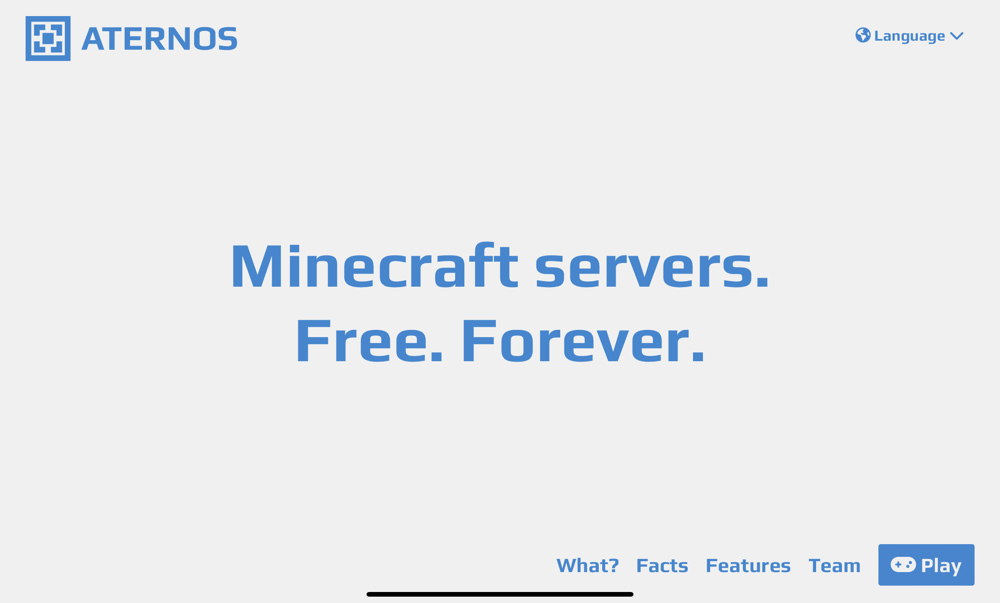

You may want to make a minecraft server but what tools do you use? well we have the answer for you!
let us introduce artenos! artenos is a free easy to use tool to make a minecraft sever just put in the 3 inputs and your now in the server which your friends can play  with lots of fun so how do i setup artenos? first go to ”artenos.org”

